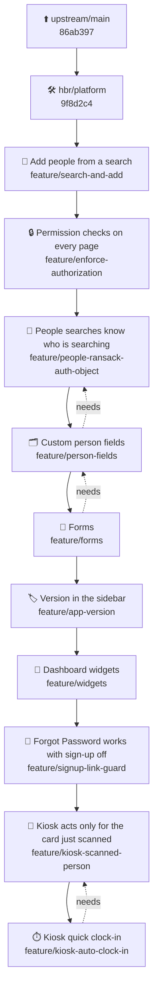

# 📦 HBR build catalog

> [!NOTE]
> Generated by `bin/fork-changelog` each time `bin/fork-rebuild` runs. Don't edit it here: change `fork/catalog.yml` or `FORK.md` on `hbr/platform`, then rebuild.

- 🏷️ **Release:** `v0.0.0-hbr.13` when tagged (not tagged yet)
- 🔨 **Build:** `fd4e313` on `hbr/integration`, 2026-10-10
- ⬆️ **Upstream base:** `86ab397` Merge pull request #532 from thatnerdjack/fix/flag-review-500 (2026-10-08)
- 🧩 **Features:** 10 merged
- ⏮️ **Previous release:** `v0.0.0-hbr.12` (`2c33a04`, 2026-10-10)

**Contents:** [Try this build](#try) · [How it's built](#build) · [Features](#catalog) · [What's new](#whats-new) · [Disabled and retired](#disabled)

<a id="try"></a>

## 🧪 Try this build

Load the Northwind sample data into an empty database, then sign in as `admin@example.com` with the password `password123`:

```bash
bin/rails hbr:sample_data
```

[`fork/sample_data/README.md`](fork/sample_data/README.md) lists every login, what to try in each feature, and how to load the data from the release image.

<a id="build"></a>

## 🧬 How this build is made

Each box is merged on top of the one before it, top to bottom. Dotted arrows point from a feature to a feature it needs.



<a id="catalog"></a>

## 🗂️ Features in this build

In merge order. **Status** is where the feature stands with upstream GatherPack: 🚧 wip means it hasn't been offered upstream (yet, or ever), 📬 proposed means a pull request is open.

| Feature | Status | Turned on by | Shipped |
|---|---|---|---|
| [🔎 Add people from a search](#feature-search-and-add) | 🚧 wip | always on | hbr.1 |
| [🔒 Permission checks on every page](#feature-enforce-authorization) | 📬 proposed | always on | hbr.3 |
| [🧭 People searches know who is searching](#feature-people-ransack-auth-object) | 🚧 wip | always on | hbr.4 |
| [🗂️ Custom person fields](#feature-person-fields) | 🚧 wip | `feature_person_fields` | hbr.4 |
| [📝 Forms](#feature-forms) | 🚧 wip | `feature_forms` +2 | hbr.7 |
| [🏷️ Version in the sidebar](#feature-app-version) | 🚧 wip | `GATHERPACK_VERSION` | hbr.6 |
| [🧱 Dashboard widgets](#feature-widgets) | 🚧 wip | `feature_widgets` | hbr.8 |
| [🔑 Forgot Password works with sign-up off](#feature-signup-link-guard) | 🚧 wip | `local_signup` | hbr.10 |
| [🪪 Kiosk acts only for the card just scanned](#feature-kiosk-scanned-person) | 🚧 wip | always on | hbr.12 |
| [⏱️ Kiosk quick clock-in](#feature-kiosk-auto-clock-in) | 🚧 wip | `time_kiosk_allow_unassigned` +2 | hbr.12 |

<a id="feature-search-and-add"></a>

### 🔎 Add people from a search

Badge holders, team members, a person's teams and event check-ins each get a search panel beside the list. Type a name and press Add; the list updates in place, and only people or teams that can still be added are shown.

- 👥 **Who uses it:** Team managers and admins
- ⚙️ **Settings:** none; always on
- 🔄 **Upstream:** 🚧 wip
- 🚀 **Shipped in:** hbr.1
- 🌿 **Branch:** `feature/search-and-add` at `cbbccb2`
- 🗃️ **Migrations:** none

<a id="feature-enforce-authorization"></a>

### 🔒 Permission checks on every page

Every page now checks who may see or change it. Members can no longer delete their team, edit its announcements, change other people's check-ins or edit badge types. People who were already allowed to do these things see no change.

- 👥 **Who uses it:** Everyone (behind the scenes)
- ⚙️ **Settings:** none; always on
- 🔄 **Upstream:** 📬 proposed · PR [#518](https://github.com/GatherPack/gatherpack/pull/518), issue [#517](https://github.com/GatherPack/gatherpack/issues/517)
- 🚀 **Shipped in:** hbr.3
- 🌿 **Branch:** `feature/enforce-authorization` at `7a5922d`
- 🗃️ **Migrations:** none

<a id="feature-people-ransack-auth-object"></a>

### 🧭 People searches know who is searching

Every search over people (the directory, person search, team members, birthdays on the calendar) now knows who is asking. Nothing changes on screen; it lets Custom person fields keep hidden details out of search results.

- 👥 **Who uses it:** Everyone (behind the scenes)
- ⚙️ **Settings:** none; always on
- 🔄 **Upstream:** 🚧 wip
- 🚀 **Shipped in:** hbr.4
- 🌿 **Branch:** `feature/people-ransack-auth-object` at `449e0de`
- 🗃️ **Migrations:** none

<a id="feature-person-fields"></a>

### 🗂️ Custom person fields

Admins add their own profile fields, such as medical notes or an emergency contact, and choose who can see and change each one: the person, their guardians, their team's leaders, or holders of a badge. Built-in details like phone, address and birthday follow the same rules, even with the setting off.

- 👥 **Who uses it:** Admins set fields up; everyone who views profiles
- ⚙️ **Settings:**
  - Custom Person Fields (`feature_person_fields`): default off
- 🔄 **Upstream:** 🚧 wip · Issue [#489](https://github.com/GatherPack/gatherpack/issues/489)
- 🚀 **Shipped in:** hbr.4
- 🌿 **Branch:** `feature/person-fields` at `c050087`
- 🔗 **Needs:** [🧭 People searches know who is searching](#feature-people-ransack-auth-object)
- 🗃️ **Migrations:** 7

<details><summary>Migrations</summary>

- `20261002200000_add_guardianship_to_relationship_types.rb`
- `20261002200100_create_person_field_groups.rb`
- `20261002200200_create_person_fields.rb`
- `20261002200300_create_person_field_values.rb`
- `20261002200400_create_person_field_badge_grants.rb`
- `20261003120000_create_system_person_fields.rb`
- `20261003130000_add_person_field_and_read_permission_to_checkin_fields.rb`

</details>

<a id="feature-forms"></a>

### 📝 Forms

Leaders ask a group of people for information by a deadline: meal choices, permission slips, or who is coming to an event. People find their forms on the dashboard and their profile, guardians can answer and sign for their students, and leaders see who still owes an answer and print lists of the answers.

- 👥 **Who uses it:** Members and families answer; leaders and form creators ask
- ⚙️ **Settings:**
  - Forms (`feature_forms`): default off
  - Form Creator Badge (`forms_creator_badge`): default blank (no form creators)
  - Highest Team for Form Creators (`forms_creator_highest_team`): default blank (only their own teams and the teams below)
- 🔄 **Upstream:** 🚧 wip
- 🚀 **Shipped in:** hbr.7
- 🌿 **Branch:** `feature/forms` at `6e58d6d`
- 🔗 **Needs:** [🗂️ Custom person fields](#feature-person-fields)
- 🗃️ **Migrations:** 11

<details><summary>Migrations</summary>

- `20261005120000_create_forms.rb`
- `20261005120100_create_form_questions.rb`
- `20261005120200_create_form_responses.rb`
- `20261005120300_create_form_submissions.rb`
- `20261005120400_create_form_reminders.rb`
- `20261006120000_create_form_audience_rules.rb`
- `20261006120100_create_form_signatures.rb`
- `20261006120200_create_form_badge_grants.rb`
- `20261006120300_add_consent_columns_to_forms.rb`
- `20261006130000_add_event_to_forms.rb`
- `20261006140000_add_sharing_options_to_forms.rb`

</details>

<a id="feature-app-version"></a>

### 🏷️ Version in the sidebar

The sidebar shows which release is running, under "powered by GatherPack". Point at it to see the exact build. Use it when reporting a problem.

- 👥 **Who uses it:** Everyone signed in
- ⚙️ **Settings:**
  - Release number, set when the image is built (`GATHERPACK_VERSION`): default blank (nothing shown)
- 🔄 **Upstream:** 🚧 wip
- 🚀 **Shipped in:** hbr.6
- 🌿 **Branch:** `feature/app-version` at `6b08f39`
- 🗃️ **Migrations:** none

<a id="feature-widgets"></a>

### 🧱 Dashboard widgets

Admins add titled sections to the dashboard, such as a kickoff countdown, shop hours for the week, or who is clocked in right now. Each widget can be shown to everyone or only to some people, and can refresh itself.

- 👥 **Who uses it:** Admins write them; everyone sees the ones meant for them
- ⚙️ **Settings:**
  - Dashboard Widgets (`feature_widgets`): default off
- 🔄 **Upstream:** 🚧 wip
- 🚀 **Shipped in:** hbr.8
- 🌿 **Branch:** `feature/widgets` at `aa05189`
- 🗃️ **Migrations:** 1

<details><summary>Migrations</summary>

- `20261006200000_create_widgets.rb`

</details>

<a id="feature-signup-link-guard"></a>

### 🔑 Forgot Password works with sign-up off

With local sign-up turned off, the Forgot Password page used to crash. It now opens normally and hides the sign-up link, like the sign-in page does.

- 👥 **Who uses it:** Anyone who signs in with an email and password
- ⚙️ **Settings:**
  - Enable Creating Local Accounts, an existing setting (`local_signup`): default on
- 🔄 **Upstream:** 🚧 wip
- 🚀 **Shipped in:** hbr.10
- 🌿 **Branch:** `feature/signup-link-guard` at `3239a70`
- 🗃️ **Migrations:** none

<a id="feature-kiosk-scanned-person"></a>

### 🪪 Kiosk acts only for the card just scanned

The time kiosk's buttons work only for the person whose card was just scanned, and only for a few minutes. No one can clock someone else in or out from a link or by changing the page, and rapid card guessing is blocked.

- 👥 **Who uses it:** People clocking in at the kiosk
- ⚙️ **Settings:** none; always on
- 🔄 **Upstream:** 🚧 wip
- 🚀 **Shipped in:** hbr.12
- 🌿 **Branch:** `feature/kiosk-scanned-person` at `7a79080`
- 🗃️ **Migrations:** none

<a id="feature-kiosk-auto-clock-in"></a>

### ⏱️ Kiosk quick clock-in

Admins can have a scan clock the person in right away when only one time period applies to them, send the kiosk back to the welcome screen after a few seconds, and choose a team whose members may open the kiosk. When a scan can clock people in, the button reads Clock In. An unrecognized card shows "Card not recognized" on the welcome screen. With the default settings the kiosk otherwise works as before.

- 👥 **Who uses it:** People clocking in at the kiosk; admins set it up
- ⚙️ **Settings:**
  - Kiosk: Allow Unassigned Punches (`time_kiosk_allow_unassigned`): default on
  - Kiosk: Return to Welcome After (seconds) (`time_kiosk_return_seconds`): default 0 (stays on the person's screen)
  - Kiosk: Who Can Open the Kiosk (`time_kiosk_users_team`): default blank (anyone signed in)
- 🔄 **Upstream:** 🚧 wip
- 🚀 **Shipped in:** hbr.12
- 🌿 **Branch:** `feature/kiosk-auto-clock-in` at `b756cf5`
- 🔗 **Needs:** [🪪 Kiosk acts only for the card just scanned](#feature-kiosk-scanned-person)
- 🗃️ **Migrations:** none

<a id="whats-new"></a>

## 🆕 What's new since v0.0.0-hbr.12

Commits in this build that weren't in `v0.0.0-hbr.12`, oldest first. A commit that was rebased or cherry-picked (same author, date and subject) counts as already released.

**No changes:** 🔎 Add people from a search, 🔒 Permission checks on every page, 🧭 People searches know who is searching, 🗂️ Custom person fields, 📝 Forms, 🏷️ Version in the sidebar, 🧱 Dashboard widgets, 🔑 Forgot Password works with sign-up off, 🪪 Kiosk acts only for the card just scanned, ⏱️ Kiosk quick clock-in

### ⬆️ Upstream

No new upstream commits (still on `86ab397`).

### 🛠️ Fork tooling (`hbr/platform`)

<details><summary>4 changes</summary>

- Record the kiosk branches as shipped in hbr.12 (`740b79b`)
- Add a spec for sample data in every build (`dcd65dc`)
- Record the sample data spec decisions (`a64396b`)
- Load Northwind sample data into any build (`9f8d2c4`)

</details>

<a id="disabled"></a>

## 💤 Disabled and retired

**Disabled in the manifest** (commented out in `fork/features.txt`, so not in this build):

- None

**Retired** (marked `retired` in `FORK.md`; no longer merged):

<details><summary>9 retired features</summary>

| Branch | Shipped | Upstream |
|---|---|---|
| `feature/audit-log-nil-changes` | hbr.1 | PR [#515](https://github.com/GatherPack/gatherpack/pull/515), issue [#517](https://github.com/GatherPack/gatherpack/issues/517) |
| `feature/membership-create-policy` | hbr.1 | PR [#521](https://github.com/GatherPack/gatherpack/pull/521), issue [#517](https://github.com/GatherPack/gatherpack/issues/517) |
| `feature/unique-assignments` | hbr.1 | PR [#522](https://github.com/GatherPack/gatherpack/pull/522), issue [#517](https://github.com/GatherPack/gatherpack/issues/517) |
| `feature/membership-filters-fix` | hbr.1 | PR [#516](https://github.com/GatherPack/gatherpack/pull/516), issue [#517](https://github.com/GatherPack/gatherpack/issues/517) |
| `feature/brakeman-8.1` | hbr.1 | — |
| `feature/calendar-birthday-team-filter` | hbr.3 | PR [#519](https://github.com/GatherPack/gatherpack/pull/519), issue [#517](https://github.com/GatherPack/gatherpack/issues/517) |
| `feature/user-display-name` | hbr.5 | PR [#520](https://github.com/GatherPack/gatherpack/pull/520), issue [#517](https://github.com/GatherPack/gatherpack/issues/517) |
| `feature/team-page-qa-crash` | hbr.6 | PR [#523](https://github.com/GatherPack/gatherpack/pull/523), issue [#517](https://github.com/GatherPack/gatherpack/issues/517) |
| `feature/team-page-parent-managers` | hbr.6 | PR [#524](https://github.com/GatherPack/gatherpack/pull/524), issue [#517](https://github.com/GatherPack/gatherpack/issues/517) |

</details>

---

<sub>Made by `bin/fork-changelog` from `fork/features.txt`, `fork/catalog.yml` and `FORK.md` at `9f8d2c4`.</sub>
